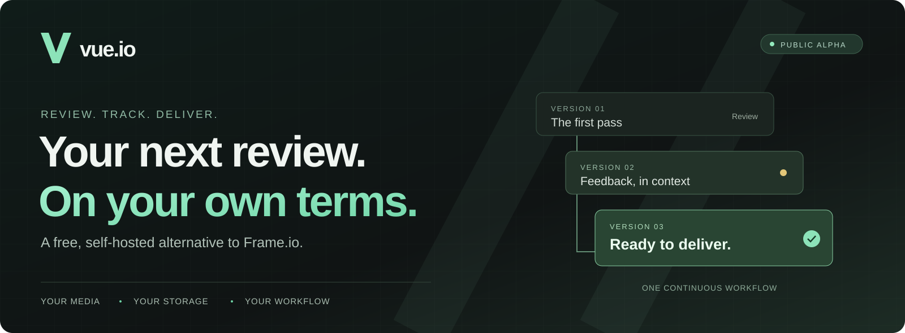
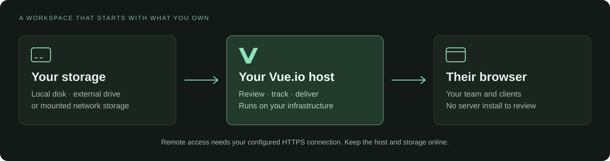

<p align="center">
  
</p>
<p align="center">
  <strong>Frame.io-style review. Your own storage. No per-seat fees.</strong><br>
  Version history, visual feedback, shot tracking, and file delivery in one workspace.
</p>
<p align="center">
  <a href="https://rfxmedia.github.io/vueio/">Documentation</a> ·
  <a href="docs/GETTING_STARTED.md">Install Vue.io</a> ·
  <a href="https://github.com/rfxmedia/vueio/releases/latest">Latest release</a> ·
  <a href="https://github.com/rfxmedia/vueio/issues">Feedback &amp; bugs</a>
</p>

---

## Your media already has a home. Review it there.

Vue.io is a **free, self-hosted alternative to Frame.io** for post-production
teams. Give clients a familiar browser review experience while keeping media
on storage you control. Keep versions, feedback, shot status, project files,
and delivery together instead of managing them across separate tools.

Built inside a working VFX studio and used on real productions. Made for the
work between the first upload and the final delivery.

<a href="docs/assets/tracker.png">
  
</a>

*Actual Vue.io interface. LOW TIDE is a fictional demonstration project with synthetic media and team profiles.*

## Review is only the beginning

| Review every version | Keep production together | Deliver from your storage |
| --- | --- | --- |
| Browser playback and version history | Shot trackers with statuses and assignments | Selected local, USB, or mounted network storage |
| Timestamped comments and visual annotations | Briefs and latest notes alongside each shot | Review links and file downloads |
| Version comparison and preview LUTs | Project pages and a shared file navigator | File requests for incoming media |
| Voice notes and comment attachments | Project and role-based access | No Vue.io per-seat or cloud-storage subscription |

**Not just a player with a comment box.** Follow a shot from its brief to the
latest version, review it in context, and hand over the files without losing
the conversation.

[Explore the review workflow →](docs/REVIEW_WORKFLOW.md)

## Self-hosted means you stay in control



The software is free to self-host under the [PolyForm Perimeter license](LICENSE.md).
Bring your own hardware and storage; you manage uptime, connectivity, and backups.
Your storage and upload connection set the practical capacity—not a Vue.io cloud plan.

Vue.io is **source-available, not OSI open source**. It is an independent product,
not affiliated with or endorsed by Frame.io or Adobe, and does not claim complete
Frame.io feature parity or automatic project migration.

## Start with one project

**Server:** 64-bit Linux, Docker Engine + Compose v2, and Python 3.9+.
Start with 4 CPU cores, 8 GiB RAM, and 40 GiB free space, plus room for media.

Run this on the computer that will host Vue.io:

```bash
curl -fsSL https://github.com/rfxmedia/vueio/releases/latest/download/install.sh | sh
```

Choose separate locations for Vue data and media. The installer prints your
local address and one-time setup code. Open that address, create the owner
account, and start your first project.

**Viewing a review link does not require installing the server.** Installation
requirements apply to the host, not every teammate's computer.

| Host platform | Current status |
| --- | --- |
| Linux x86-64 / ARM64 | Primary alpha installation |
| Apple Silicon Mac | Experimental; read the [Mac limitations](docs/SELF_HOSTING.md#mac-installer-preview) |
| Intel Mac / native Windows | No supported installer yet |

> **Public alpha.** Start with trusted users and non-sensitive test media.
> Keep independent backups. Internet access needs an HTTPS proxy, VPN, or tunnel
> that you configure; Vue.io does not provide a built-in public tunnel.
> Read the [latest release notes](https://github.com/rfxmedia/vueio/releases/latest)
> for known issues and security findings before installing.

[Step-by-step setup →](docs/GETTING_STARTED.md) · [Administrator guide →](docs/SELF_HOSTING.md)

## A guide for every step

- **[Documentation home](https://rfxmedia.github.io/vueio/)** — the browsable guide to Vue.io.
- **[First installation](docs/GETTING_STARTED.md)** — prepare a host and open your workspace.
- **[Review and version history](docs/REVIEW_WORKFLOW.md)** — track shots, review changes, and keep feedback in context.
- **[Sharing and delivery](docs/SHARING.md)** — review links, downloads, and incoming files.
- **[Storage, updates, and backups](docs/STORAGE_OPERATIONS.md)** — keep your workspace running.
- **[Troubleshooting](docs/TROUBLESHOOTING.md)** — resolve common installation and media problems.
- **[FAQ](docs/FAQ.md)** — cost, licensing, compatibility, and hosting.

## Help make the next review better

Try a small project. Tell us where you got stuck, what worked, or what would
make your next delivery easier.

[Open an issue](https://github.com/rfxmedia/vueio/issues) with your release,
host platform, expected result, and steps to reproduce. Remove private media,
share links, credentials, and personal information before posting.

If Vue.io looks useful, **star the repository** to help others discover it.
Follow [releases](https://github.com/rfxmedia/vueio/releases) for updates.

### Engineering and security

Vue.io uses human-directed, AI-assisted engineering and supports agent-assisted
media workflows. Public use is still alpha testing, not a guarantee that every
environment has been verified. See the [security policy](SECURITY.md)
to report vulnerabilities privately and the [release notes](https://github.com/rfxmedia/vueio/releases)
for each version's checks, limitations, and known findings.
