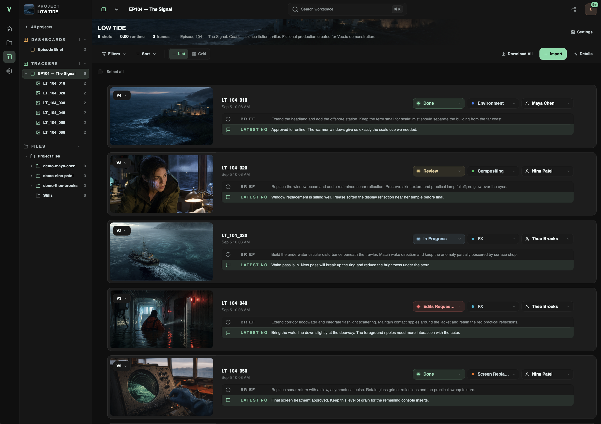

# Review and version history

Keep the shot, its versions, and the conversation in the same place.
Vue.io combines media review with the surrounding production workflow.

*LOW TIDE is a fictional demo project with synthetic media and team profiles.*

## Organize a project

A project brings together trackers, files, and project pages. Use a tracker
for a sequence, episode, or delivery group. Use project pages for briefs and
reference information that the team needs alongside the media.

Trackers organize shots with a status, assignee, tags, and a brief. The file
navigator keeps available files close to the review workflow. Access depends
on each user's project and workspace permissions.

## Keep revisions on the same shot

Import the initial media, then add subsequent revisions as versions of the
same shot. Use the version selector to return to an earlier revision instead
of creating a separate shot for every export.

This is **media version history**, not Git-style source control. It does not
merge edits or replace versioning in your creative application.

## Leave feedback in context

Open a shot version or supported file in the viewer. For video, move to the
relevant moment before writing a note. Use visual annotations when a specific
area needs attention, and reply to the existing conversation when following up.

Comments can include attachments and voice notes. English voice-note
transcription runs inside the media engine with the bundled model rather
than sending the audio to a transcription service.

Keep the **brief** for the intended work and the **latest notes** for the
current revision. Changing a shot's status is not the same as adding a version.

## Compare revisions

Use the viewer's version comparison controls to inspect two available versions.
Check the selected versions before making a judgment. Availability depends on
the media and its previews; read current release notes for fixes and limitations.

## Preview a look without changing the source

Use **Color preview** to apply a saved workspace LUT or a temporary `.cube`
file. Administrators manage the shared library in **Settings → Preview LUTs**.

LUTs affect the preview, not original media or ordinary downloads. Select a
LUT appropriate for the source encoding. Browser preview is not a substitute
for a calibrated color-finishing pipeline.

[LUT formats and limits →](SELF_HOSTING.md#workspace-preview-luts)

## Finish with a handoff

Confirm the intended version and files, then use the appropriate share or
delivery action. Check the result as a recipient, including available downloads.

[Sharing and delivery →](SHARING.md)
